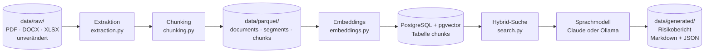

# Architektur: die Pipeline im Überblick

Dieses Dokument gibt den Überblick. Für Details:

- Ablaufdiagramme: [diagrams/pipeline.puml](diagrams/pipeline.puml) (Einlesen und Einbetten), [diagrams/search.puml](diagrams/search.puml) (Hybrid-Suche), [diagrams/report.puml](diagrams/report.puml) (Risikobericht)
- Signaturen und Projekttrennung: [spezifikation.md](spezifikation.md)
- Bedienung: [../README.md](../README.md)

## Der Weg eines Dokuments

Jeder Schritt erzeugt nur **abgeleitete** Daten. Die Originale bleiben unverändert liegen und werden genau einmal gelesen.

## Die Schritte

| # | Schritt | Modul | Ergebnis |
|---|---|---|---|
| 1 | **Einlesen** – Dateien finden, Projekt und Dokumentart aus den Ordnern ableiten, Inhalt hashen | `pipeline.py` | `Document` je Dateiversion |
| 2 | **Extraktion** – PDF-Seite, Protokoll-TOP oder Tabellenzeile als Einheit; Überschriften aus der Schriftgröße | `extraction.py` | `Segment` |
| 3 | **Chunking** – Schnitt an Satzgrenzen, höchstens 1200 Zeichen, 150 Zeichen Überlappung, nie über Segmentgrenzen | `chunking.py` | `Chunk` mit vollständiger Herkunft |
| 4 | **Speichern** – feste Polars-Schemas | `pipeline.py` | drei Parquet-Dateien |
| 5 | **Einbetten** – `multilingual-e5-base`, 768 Dimensionen, Überschrift als Kontext nur für das Modell | `embeddings.py`, `db.py` | Vektoren in PostgreSQL |
| 6 | **Suchen** – Vektorsuche und Volltextsuche, zusammengeführt per Reciprocal Rank Fusion | `search.py` | Treffer mit Quellenangabe |
| 7 | **Analysieren** – Belege je Risikokategorie sammeln, ein Aufruf ans Sprachmodell, jeden Beleg prüfen | `report.py`, `risks.py` | geprüfter `RiskReport` |
| 8 | **Ausgeben** – Markdown zum Lesen, JSON zum Bewerten | `report_markdown.py` | Bericht in `data/generated/` |

Schritt 1 bis 4 ist Phase 1, Schritt 5 und 6 ist Phase 2, Schritt 7 und 8 ist Phase 3.

## Warum drei Ebenen statt einer

`Document → Segment → Chunk` trennt die Ebenen bewusst:

- **Document** ist eine Version einer Datei, erkennbar am Inhalts-Hash. Eine geänderte Datei ergibt eine neue Version, die alte bleibt erhalten.
- **Segment** ist das Ergebnis der Extraktion. Es wird gespeichert, damit neu gechunkt werden kann, ohne die Originale erneut zu lesen.
- **Chunk** ist die durchsuchbare Einheit. Er trägt Projekt, Datei, Version, Seite oder Abschnitt und Datum redundant mit sich. Deshalb ist ein Suchtreffer ohne Join zitierfähig.

## Wo die Prüfungen sitzen

- **Projekttrennung:** `project_id` ist in Suche und Analyse ein Pflichtargument ohne Vorgabe. Eine projektübergreifende Suche lässt sich gar nicht formulieren. Jede Funktion prüft zusätzlich das Format der ID.
- **Inkrementell:** Bekannte Dokumentversionen und bereits eingebettete Chunks werden übersprungen.
- **Quellenpflicht:** Das Sprachmodell darf nur Quellen zitieren, die es bekommen hat. `report.check_sources` prüft je Beleg, ob die `chunk_id` geliefert wurde, zum Projekt gehört und der Auszug wörtlich im Chunk steht. Bei einem Fehler bessert das Modell nach; gelingt das nicht, entsteht **kein** Bericht.
- **Getrennte Ebenen im Bericht:** Fakten (belegt), Schlussfolgerungen (abgeleitet) und Unsicherheiten stehen in eigenen Feldern.

## Wo künstliche Intelligenz im Spiel ist

Nur an zwei Stellen. Alles andere ist gewöhnlicher, nachvollziehbarer Code.

| Stelle | Modell | Läuft |
|---|---|---|
| Schritt 5 und 6: Text in Vektoren | `multilingual-e5-base` | lokal im Python-Prozess |
| Schritt 7: Risiken ableiten | Claude oder ein lokales Modell über Ollama | als eigener Dienst hinter HTTP |

Das Sprachmodell ist der einzige Baustein, der Dinge erfinden kann. Deshalb steht hinter ihm die Quellenprüfung. Die Entscheidung, es als eigenen Dienst zu betreiben, steht in [../CLAUDE.md](../CLAUDE.md#sprachmodell-als-eigener-dienst).

## Messen statt schätzen

Jede Stufe hat einen Maßstab, der auf den bekannten Sachverhalten aus [testdaten.md](testdaten.md) beruht:

- **Suche:** `evaluate_search.py` misst den Recall@k über 20 Fragen (Hybrid: 96 % bei k = 10).
- **Bericht:** `evaluate_report.py` prüft gespeicherte Berichte auf die sechs Sachverhalte, die Zusammenhänge, Ablenker, Projekttrennung, Nachbesserungen und Laufzeit.

## Vom Prototyp zur Zielarchitektur

Heute läuft alles als Skripte auf einem Rechner. Die Zielarchitektur aus [../CLAUDE.md](../CLAUDE.md) teilt dieselben Schritte auf Dienste auf: Schritt 1 bis 4 wird zum `document-worker`, Schritt 5 zum `embedding-worker`, Schritt 6 bis 8 zur `report-api`. RabbitMQ verbindet sie, MinIO ersetzt `data/`. Die Module bleiben dieselben; es ändert sich, wer sie aufruft.
